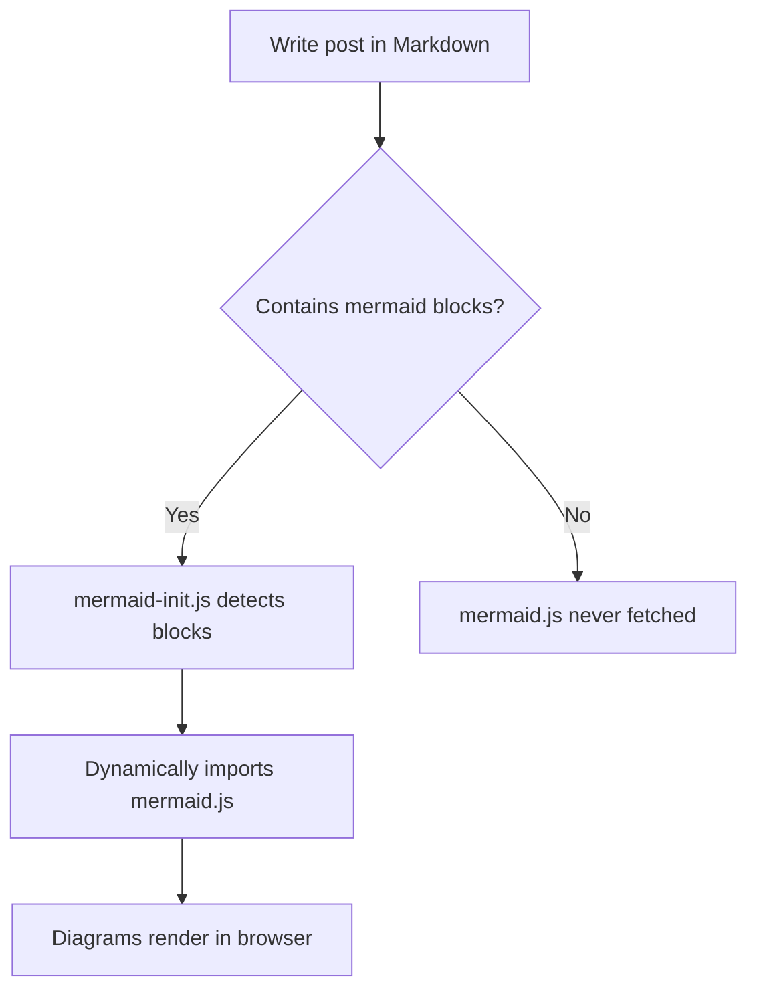
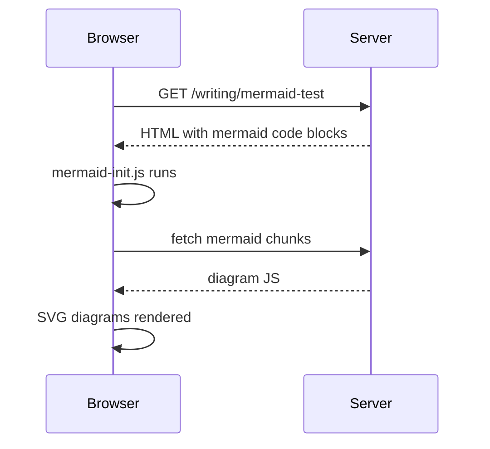

This is a test post to verify that Mermaid diagrams render correctly.

## Flowchart

```mermaid
flowchart TD
    A[Write post in Markdown] --> B{Contains mermaid blocks?}
    B -- Yes --> C[mermaid-init.js detects blocks]
    C --> D[Dynamically imports mermaid.js]
    D --> E[Diagrams render in browser]
    B -- No --> F[mermaid.js never fetched]
```

## Sequence diagram

```mermaid
sequenceDiagram
    participant Browser
    participant Server
    Browser->>Server: GET /writing/mermaid-test
    Server-->>Browser: HTML with mermaid code blocks
    Browser->>Browser: mermaid-init.js runs
    Browser->>Server: fetch mermaid chunks
    Server-->>Browser: diagram JS
    Browser->>Browser: SVG diagrams rendered
```
